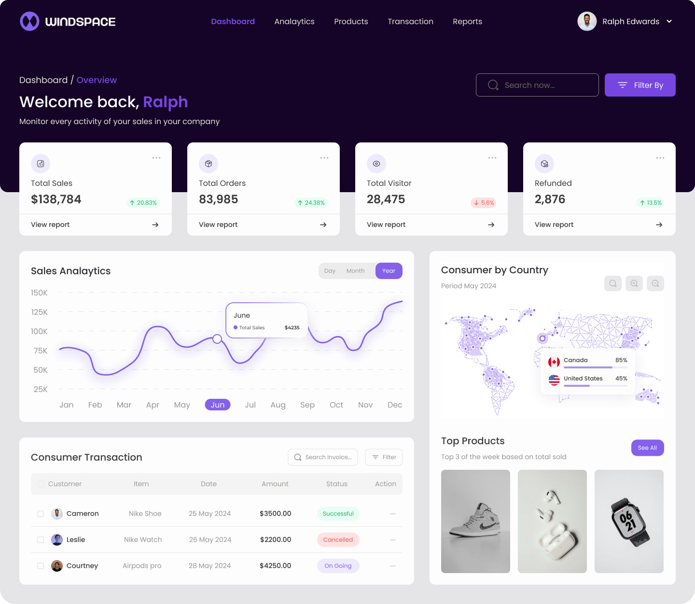

# Freiplatzfinder

Eine mobile-optimierte Webapp zur Verwaltung und Suche von freien Plätzen und Stunden in Jugendhilfeeinrichtungen nach SGB VIII.



## Projektübersicht

Freiplatzfinder bietet vier Benutzerrollen mit unterschiedlichen Berechtigungen und Funktionen:

1. **Administrator**: Verwaltet Benutzerkonten, Träger und Kategorien
2. **Träger**: Verwaltet eigene Einrichtungen und verfügbare Plätze
3. **Fallmanager**: Sucht nach freien Plätzen mit Drill-Down-Navigation
4. **Amtsleitung**: Nutzt umfangreiche Auswertungsmöglichkeiten

## Technischer Stack

### Frontend
- React.js mit TypeScript
- Tailwind CSS für responsive Design
- Context API für State Management
- React Router für Routing
- Formik mit Yup für Validierung

### Backend
- Node.js mit Express
- RESTful API
- JWT für Authentifizierung
- Sequelize als ORM
- PostgreSQL als Datenbank

### DevOps
- Docker für Containerisierung
- CI/CD mit GitHub Actions

## Installation und Setup

### Voraussetzungen
- Node.js (v16 oder höher)
- npm oder yarn
- Docker und Docker Compose
- PostgreSQL

### Entwicklungsumgebung einrichten

1. Repository klonen:
   ```
   git clone https://github.com/yourusername/freiplatzfinder.git
   cd freiplatzfinder
   ```

2. Initialisierungsskript ausführen:
   ```
   chmod +x infrastructure/scripts/init-project.sh
   ./infrastructure/scripts/init-project.sh
   ```

   Dieses Skript führt folgende Schritte aus:
   - Installation aller Abhängigkeiten
   - Erstellung der .env-Dateien aus den Vorlagen
   - Start der Docker-Container für Datenbank und Redis
   - Ausführung der Datenbankmigrationen
   - Befüllung der Datenbank mit Testdaten

3. Entwicklungsserver starten:
   ```
   npm run dev
   ```

4. Die Anwendung ist nun verfügbar unter:
   - Frontend: http://localhost:3000
   - Backend API: http://localhost:4000

## Projektstruktur

```
freiplatzfinder/
├── frontend/           # React-Frontend mit TypeScript und Tailwind CSS
│   ├── src/
│   │   ├── assets/     # Bilder, Styles und andere Assets
│   │   ├── components/ # React-Komponenten nach Rollen organisiert
│   │   ├── contexts/   # React Context für State Management
│   │   ├── hooks/      # Custom React Hooks
│   │   ├── pages/      # Seitenkomponenten nach Rollen organisiert
│   │   ├── services/   # API-Services und andere Dienste
│   │   ├── types/      # TypeScript-Typdefinitionen
│   │   └── utils/      # Hilfsfunktionen und Utilities
│   └── public/         # Statische Dateien
│
├── backend/            # Express-Backend mit TypeScript und Sequelize
│   ├── src/
│   │   ├── api/        # API-Routen nach Rollen organisiert
│   │   ├── config/     # Konfigurationsdateien
│   │   ├── controllers/# Controller nach Rollen organisiert
│   │   ├── middlewares/# Express-Middlewares
│   │   ├── models/     # Sequelize-Modelle
│   │   ├── services/   # Business-Logik und Dienste
│   │   ├── utils/      # Hilfsfunktionen und Utilities
│   │   ├── validations/# Validierungsschemas
│   │   ├── migrations/ # Datenbankmigrationen
│   │   └── seeds/      # Seed-Daten für die Datenbank
│   └── uploads/        # Hochgeladene Dateien
│
├── docs/               # Dokumentation
│   ├── api/            # API-Dokumentation
│   ├── database/       # Datenbankschema
│   ├── deployment/     # Deployment-Anleitung
│   └── user/           # Benutzerhandbücher
│
├── infrastructure/     # Docker und Deployment-Konfigurationen
│   ├── docker/         # Dockerfile für Frontend und Backend
│   └── scripts/        # Skripte für Deployment und Initialisierung
│
└── .github/            # GitHub Actions Workflows
```

## Dokumentation

Ausführliche Dokumentation finden Sie im `docs/`-Verzeichnis:

- API-Dokumentation: `docs/api/`
- Datenbankschema: `docs/database/`
- Deployment-Anleitung: `docs/deployment/`
- Benutzerhandbücher: `docs/user/`

## Testbenutzer

Nach der Initialisierung stehen folgende Testbenutzer zur Verfügung:

| E-Mail | Passwort | Rolle |
|--------|----------|-------|
| admin@example.com | password123 | Administrator |
| carrier@example.com | password123 | Träger |
| manager@example.com | password123 | Fallmanager |
| leadership@example.com | password123 | Amtsleitung |

## Lizenz

[MIT](LICENSE)
